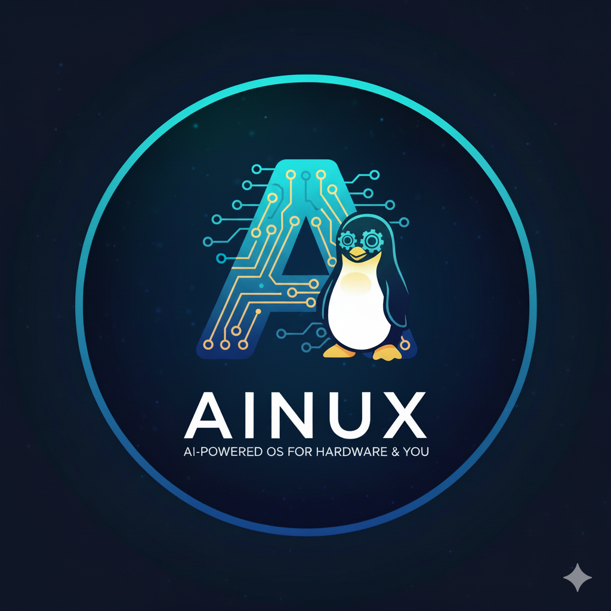

# Ainux

<p align='center'>
  
</p>

Ainux is an AI-native operating system concept that layers intelligent
automation and hardware orchestration on top of a familiar Linux user
experience. This repository now contains both the high-level architecture
vision and the initial tooling required to assemble an Ubuntu-based live ISO
that demonstrates those ideas.

## Repository Structure

- `docs/ai_friendly_os_design.md` – Design document outlining the Ainux vision
  and automation architecture.
- `build/ubuntu-ainux/` – Scripts and configuration to generate an Ubuntu
  remix ISO with Ainux defaults baked in, including AI-driven maintenance,
  scheduling, and network automation helpers.
- `ainux_ai/` – Python GPT client, 자연어 오케스트레이터, 컨텍스트 패브릭, 지능형
  하드웨어 자동화 툴킷, 그리고 OpenAI 호환 API와 통신하는 CLI.

## Quick Start

To build the prototype ISO **use a dedicated build host or disposable VM**.
The pipeline never "layers" on top of an existing Ubuntu install: it only
assembles a brand-new bootable ISO image inside the repository's `work/`
directory. Running the tooling on a production server may monopolise CPU, RAM,
and disk I/O while chroots and SquashFS images are assembled. The script now
requires an explicit opt-in via `AINUX_ALLOW_BUILD=1` so accidental executions
are blocked by default. If the process appears to stop immediately, double-
check that the environment variable was exported on the same command line.

To continue once you are in a safe environment:

```bash
git clone https://github.com/<your-org>/Ainux.git
cd Ainux/build/ubuntu-ainux
sudo AINUX_ALLOW_BUILD=1 ./build.sh --release jammy --arch amd64 --output ~/ainux-jammy.iso
```

> ℹ️ **Troubleshooting:** The safety gate aborts early unless
> `AINUX_ALLOW_BUILD=1` is present. When set correctly you will see progress
> messages such as `[bootstrap]`, `[overlay]`, and `[live]`. If the build later
> halts, review `/tmp/ainux-build.log` (created automatically) for the failing
> command or rerun with `--keep-work` to inspect the generated chroot.

> 🧠 **Cross-architecture builds:** When the host CPU architecture (e.g. `amd64`)
> differs from the target passed via `--arch` (e.g. `arm64`), install
> `qemu-user-static` and `binfmt-support` in addition to the standard ISO tools.
> The script now detects the mismatch automatically, runs debootstrap in
> `--foreign` mode, and executes the second stage inside the chroot using the
> appropriate QEMU static binary. Without those packages debootstrap will fail
> with errors such as `Failure trying to run: chroot ... /bin/true`.

Refer to `build/ubuntu-ainux/README.md` for prerequisites and customization
options, including the new scheduling/packet-management blueprints seeded into
the live image.

## Configuring GPT access

The repository ships with a reusable CLI (`ainux-client`, with a backwards-
compatible `ainux-ai-chat` alias) and Python module (`ainux_ai`) that connect to
GPT-style APIs. Configure a provider once and both the live ISO and host
tooling can reuse the credentials:

```bash
# Configure an OpenAI account and make it the default provider
./ainux-client configure --api-key sk-... --default

# Update or rotate the API key later without changing other settings
./ainux-client set-key --api-key sk-new-...

# Send a quick prompt
./ainux-client chat --message "Ainux에 대해 한 문장으로 요약해줘"

# Use environment variables for ephemeral sessions
AINUX_GPT_API_KEY=sk-... AINUX_GPT_MODEL=gpt-4o-mini ./ainux-client chat --message "hello"
```

리포지토리 루트에서 실행하면 `./ainux-client` 스크립트가 바로 동작하며,
원한다면 `$PATH`에 추가하거나 심볼릭 링크를 만들어 시스템 전역에서
동일한 명령으로 사용할 수 있습니다. 기존 `python -m ainux_ai` 호출 방식도
호환성을 위해 그대로 유지됩니다.

Inside the live ISO the `ainux` user can run `ainux-client chat --interactive`
to hold multi-turn conversations, switch between multiple saved providers, and
log transcripts for auditing (the legacy `ainux-ai-chat` alias still works).

## 자연어 오케스트레이션 사용하기

`ainux-client orchestrate` 서브커맨드는 자연어 요청을 인텐트 → 실행 계획 →
안전성 검토 → (선택적) 실행 단계로 이어지는 파이프라인에 연결합니다. GPT
제공자를 설정하면 모델이 계획을 도와주고, 제공자가 없거나 `--offline`
플래그를 사용하면 휴리스틱 모드로 동작합니다.

```bash
# GPT 제공자를 활용하여 GPU 드라이버 갱신 계획을 생성하고 드라이런합니다.
./ainux-client orchestrate "CUDA랑 GPU 드라이버 최신 버전으로 맞춰줘" --dry-run

# 컨텍스트 JSON을 전달하여 유지보수 대상 정보를 함께 넘길 수도 있습니다.
./ainux-client orchestrate "금요일 21시에 추론 서버 네트워크 점검 예약해줘" \
  --context maint_window.json
```

명령어는 인텐트, 단계별 계획, 안전성 경고, 실행 로그를 콘솔에 요약하며
`--json` 플래그로 구조화된 출력을 받을 수 있습니다. 기본 레지스트리는
드라이런/청사진 기록 중심으로 구성되어 있으므로 실제 인프라 자동화에
맞게 커스텀 기능을 확장할 수 있습니다.

## 컨텍스트 패브릭 활용하기

`ainux-client context` 서브커맨드는 파일, 설정, 이벤트를 지식 그래프와
이벤트 버스로 수집하여 오케스트레이터가 참조할 수 있는 공통 상태를
만듭니다. CLI에서 즉시 스냅샷을 살펴보고 새로운 정보를 주입할 수
있습니다.

```bash
# 설계 문서를 그래프에 등록하고 태그를 달기
./ainux-client context ingest-file docs/ai_friendly_os_design.md \
  --label "Architecture spec" --tag design --tag docs

# 오케스트레이터 기본 모드를 설정 스코프에 기록
./ainux-client context ingest-setting orchestrator.mode assist --scope user

# 유지보수 이벤트를 남기고 최근 상태를 확인
./ainux-client context record-event maintenance.started \
  --data '{"target": "gpu-fleet"}'
./ainux-client context snapshot --limit-events 5

# 자연어 오케스트레이션에 컨텍스트 패브릭 스냅샷을 병합
./ainux-client orchestrate "토요일 02시에 GPU 점검 예약" --use-fabric
```

스냅샷은 `~/.config/ainux/context_fabric.json`에 저장되며, `--fabric-path`
옵션으로 경로를 재정의할 수 있습니다. 오케스트레이터는 `--use-fabric`
또는 사용자 지정 경로가 지정되면 요청/계획/실행 결과를 자동으로 이벤트로
기록합니다.

## 지능형 하드웨어 자동화

`ainux_ai.hardware` 패키지와 `ainux-client hardware` 서브커맨드는 드라이버·
펌웨어 카탈로그, 의존성 그래프, 텔레메트리 수집을 하나로 묶어 GPU/가속기
자동화를 실행합니다. 컨텍스트 패브릭을 사용하면 스캔과 실행 로그가 자동으로
지식 그래프와 이벤트 버스에 기록됩니다.

```bash
# 현재 시스템 하드웨어를 스캔하고 카탈로그에 저장
./ainux-client hardware scan

# 드라이버/펌웨어 블루프린트 확인 및 추가
./ainux-client hardware catalog show
./ainux-client hardware catalog add-driver nvidia-driver 535 --package nvidia-driver-535 \
  --package nvidia-dkms-535 --module nvidia --vendor nvidia --supports 10de:1eb8

# 감지된 컴포넌트를 기준으로 설치 계획 생성 (JSON 출력)
./ainux-client hardware plan --json

# 텔레메트리 스냅샷을 3회 수집하고 패브릭 이벤트로 남기기
./ainux-client hardware telemetry --samples 3 --interval 2
```

`--catalog-path`로 카탈로그 저장 위치를, `--fabric-path`로 패브릭 경로를
재정의할 수 있으며, `--no-fabric`을 지정하면 이벤트 로깅 없이 독립적으로
동작합니다. `hardware plan --apply`는 생성된 단계를 실제로 실행하며,
`--dry-run`과 함께 사용하면 명령어만 미리 확인할 수 있습니다.

## 인프라 스케줄링 & 네트워크 오케스트레이션

새로 추가된 `scheduler`, `network`, `cluster` 서브커맨드는 유지보수 윈도우,
배치 작업, 네트워크 정책, 클러스터 헬스를 하나의 도메인 명령 표면으로
제공합니다. 라이브 ISO에서는 `ainux-scheduler`, `ainux-network-orchestrator`,
`ainux-cluster-health` 래퍼가 각각 `ainux-client` CLI를 호출합니다 (`ainux-ai-chat`
별칭 유지).

```bash
# 사용 가능한 Ansible 블루프린트 나열 및 실행 (드라이런)
./ainux-client scheduler list --json
./ainux-client scheduler run maintenance/restart_gpu --dry-run --extra window=nightly

# SLURM 배치 작업 제출/조회/취소 + 정비 윈도우 관리
./ainux-client scheduler job -- --wrap="bash run-smoke-tests.sh" --dry-run
./ainux-client scheduler status --json
./ainux-client scheduler window create nightly-maint --duration 90 --target node-a --target node-b

# 네트워크 프로파일 저장 및 적용 (QoS/Firewall/VLAN 포함)
./ainux-client network save edge-qos --interface eno1 --qos eno1:2000 --firewall 'add rule inet filter forward drop'
./ainux-client network apply edge-qos --dry-run
./ainux-client network qos eno2:500 --dry-run

# 클러스터 헬스 스냅샷 또는 주기적 모니터링
./ainux-client cluster snapshot --json
./ainux-client cluster watch --interval 30 --limit 3
```

스케줄러 서비스는 컨텍스트 패브릭과 연동해 정비 윈도우 및 작업 이벤트를
기록하며, `scheduler targets` 명령으로 패브릭/윈도우에 등록된 호스트를 빠르게
확인할 수 있습니다. 네트워크 서비스는 QoS·VLAN 정의를 JSON에 저장하고,
`--dry-run`으로 명령 계획만 출력한 뒤 검증할 수도 있습니다.

## 브라우저 오케스트레이션 스튜디오

터미널만으로는 자연어 흐름과 실행 로그를 한눈에 보기 어렵기 때문에,
`ainux_ai.ui` 패키지는 글래스모피즘 테마의 웹 UI를 제공합니다. 0.7 릴리스
에서는 정사각형 Ainux 로고와 펭귄 마스코트를 애플리케이션에 내장(base64)
해 기본 브랜드 경험을 제공합니다. 저장소에는 바이너리 자산을 포함하지
않으므로, 필요하다면 루트 `folder/` 디렉터리에 동일한 파일명(`ainux.png`,
`ainux_penguin.png`)으로 로컬 이미지를 두거나, ISO 부팅 후 `/usr/share/ainux/branding`
에 PNG를 배치해 교체할 수 있습니다. 로컬 서버를 띄우면 브라우저 상단에서
로고가 은은하게 반복되며, 펭귄 캐릭터가 타임라인 패널과
실행 로그 카드로 이어지는 경험을 시각적으로 안내합니다. 좌측 패널은 대화형
자연어 타임라인을, 우측 패널은 계획·명령 로그·컨텍스트 패브릭 메타데이터를
실시간으로 갱신합니다.

```bash
# 기본 설정: 드라이런 모드 + 컨텍스트 패브릭 활성화
./ainux-client ui

# GPU 작업을 즉시 실행하고 싶다면 --execute를 명시
./ainux-client ui --execute --provider openai

# 서버 환경에서 브라우저 없이 띄우고 싶다면 --no-browser 사용
./ainux-client ui --host 0.0.0.0 --port 9000 --no-browser
```

UI 내 토글을 통해 드라이런/실행, 오프라인 모드, 컨텍스트 패브릭 사용 여부를
즉시 바꿀 수 있으며, 프롬프트 제출 시 오케스트레이터 결과와 계획 단계, 실행
출력, 최신 패브릭 이벤트가 카드 형태로 정리됩니다. 헤더의 브랜드 배지는
현재 제공자·실행 모드를 뱃지 형태로 보여주고, 하단 히어로 배경은 내장
이미지를 사용하되 `/usr/share/ainux/branding` 혹은 로컬 `folder/` 자산을
교체하면 곧바로 바뀝니다. GPT 제공자가 설정되지 않았거나
오류가 발생하면 경고 배지가 표시되고 휴리스틱 모드로 자동 폴백합니다.

## Current Status

Ainux is presently a concept prototype: the repository contains architecture
documentation plus tooling to assemble an Ubuntu-based ISO with automation
helpers preinstalled. The GPT connector, orchestration runtime, and context
fabric deliver an initial natural-language → plan → execution loop that can
operate with or without model assistance. The infrastructure scheduler,
network orchestrator, and cluster telemetry commands now persist state into the
context fabric and ship alongside lightweight ISO wrappers. Governance and
security controls (fine-grained permissions, policy engine, audit trail), the
plugin SDK, and the automation marketplace outlined in the design guide remain
future milestones.

## VM 실행 & 기능 체크리스트

가상 머신(VM) 환경에서도 Ainux ISO를 그대로 부팅해 사용할 수 있도록 모든
자동화 도구와 UI 서버는 사용자 공간에서 동작하며, 하드웨어 자동화 모듈은
실제 장치가 없을 경우 자동으로 시뮬레이션/드라이런 모드로 전환됩니다. 즉,
VM에서는 다음과 같은 특징을 기대할 수 있습니다.

- **ISO 부팅** – `build/ubuntu-ainux/build.sh`로 생성한 이미지를 VirtualBox,
  VMware, QEMU 등에서 바로 부팅할 수 있으며, 사용자 기본 계정(`ainux`)에
  CLI와 UI가 사전 설정되어 있습니다.
- **GPT & 오케스트레이션** – API 키를 설정하면 자연어 오케스트레이션,
  컨텍스트 패브릭, 하드웨어/네트워크/스케줄링 명령이 모두 동일하게 동작하고,
  키를 설정하지 않으면 휴리스틱 모드로 안전하게 폴백합니다.
- **하드웨어 자동화** – VM에서는 PCI/센서 정보가 제한되므로 스캔 결과가
  비어 있을 수 있지만, 카탈로그 관리·의존성 계산·텔레메트리 수집은
  시뮬레이션 데이터로 수행되어 워크플로우를 검증할 수 있습니다.
- **브라우저 스튜디오** – `./ainux-client ui --host 0.0.0.0`를 실행하면
  VM 내부 브라우저 혹은 포트 포워딩을 통해 호스트 브라우저에서 동일한 UI를
  사용할 수 있습니다.

현재 저장소는 요청하신 자동화 기능(자연어 오케스트레이션, 컨텍스트 패브릭,
지능형 하드웨어 자동화, 스케줄러/네트워크/클러스터 명령, 브랜드 UI)을 모두
포함합니다. 다만 초기 설계에서 후속 과제로 분류한 **거버넌스·보안 체계, SDK,
마켓플레이스**는 아직 구현되지 않았으며, 문서에도 미래 마일스톤으로 명시되어
있습니다.
